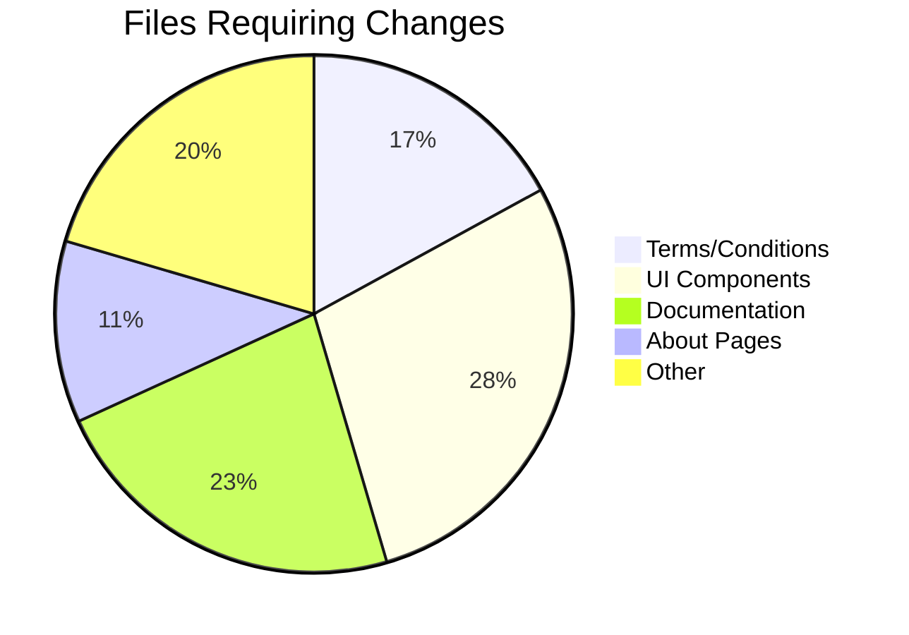

# Preserve Protocol Renaming Plan

## Objective
Rename all aesthetic/non-technical references in the codebase from:
- "Reserve" → "Preserve"
- "Reserve Protocol" → "Preserve Protocol"

## Scope

## Implementation Strategy

### 1. User Interface Text Updates
- Page titles, subtitles, buttons, tooltips
- Example changes:
  - "Welcome to Reserve" → "Welcome to Preserve"
  - "Reserve Protocol Documentation" → "Preserve Protocol Documentation"

### 2. Documentation References
- Protocol descriptions, help text
- Example:
  - "The Reserve Protocol makes trades" → "The Preserve Protocol makes trades"

### 3. Branding/Marketing Content
- About pages, value propositions
- Example:
  - "Reserve aims to help people..." → "Preserve aims to help people..."

### 4. Legal/Compliance Text
- Terms and conditions, disclaimers
- Example:
  - "Reserve.org Terms" → "Preserve.org Terms"

## Technical Considerations
- Do NOT change:
  - Token names (RSR, RSV)
  - Contract names
  - Variable/function names
  - File paths
- Maintain existing capitalization
- Update both English and Spanish locale files

## Implementation Steps
1. First update UI text and documentation
2. Then update legal/terms content
3. Finally update branding/marketing content
4. Verify no technical references were changed

## Verification
- Check all changes are aesthetic only
- Confirm no technical terms were modified
- Validate UI renders correctly
- Test functionality remains unchanged